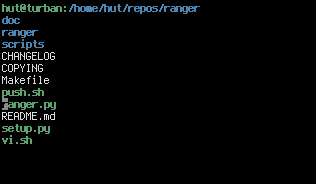

lscd v0.1
=========
lscd is a file browser with close integration with the unix shell.

About
-----
* Author:      Roman Zimbelmann
* License:     GNU General Public License Version 3
* Website:     https://github.com/hut/lscd
* Download:    https://github.com/hut/lscd/archive/master.zip
* Bug reports: https://github.com/hut/lscd/issues
* git clone    https://github.com/hut/lscd.git

Features
--------
* written in shell script, so you never really leave the shell
* text-based graphical user interface
* no dependencies except a POSIX shell and core utils
* controlled with arrow keys and some vim-like shortcuts
* may be sourced to run in the current shell environment (using ". lscd")
* when sourced, it moves you to the last opened directory on exit
* may call an arbitrary file opener; uses "less" or ranger's "rifle" by default
